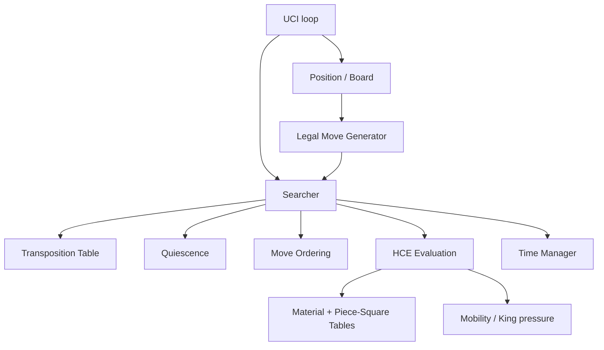

# Aquila Architecture

## Position state

The board keeps both a mailbox array and color/piece bitboards. This deliberately trades a little update work for cheap piece lookup while leaving the core representation bitboard-native.

Zobrist hashing incorporates piece-square occupancy, side to move, castling rights and en-passant square. During move execution, the key is updated incrementally by XORing only changed piece/state components; unmake restores the saved key in O(1). The repetition stack stores keys for the played line.

## Search

The search is a negamax alpha-beta tree with iterative deepening. Non-first moves use a PVS-style null window. The baseline also has TT cutoffs, quiescence, null-move pruning, futility pruning, late move reduction, killer moves and history heuristic. The TT uses four entries per bucket with generation metadata and depth/age-aware replacement so collisions do not automatically destroy unrelated entries.

The current implementation is intentionally single-threaded. SMP is a separate engineering phase because synchronization, split scheduling and shared-history quality can easily make a nominally parallel search slower.

## Evaluation

The current evaluator is an HCE baseline. NNUE is not stubbed as if it were trained. The intended production path is a separate feature/accumulator layer so that network representation and inference can evolve without rewriting move generation or search.

## Search-state invariants

The engine keeps an independent canonical Zobrist recomputation path for regression validation even though normal search uses incremental hashing. Core tests deliberately exercise captures, promotions, en-passant and castling.

TT regression tests cover clustered collisions, depth replacement, generation aging, stored bounds, depth eligibility, mate-score normalization, and the rule that a cached root result does not suppress a fresh root search.
