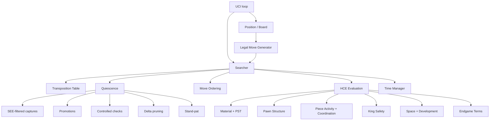
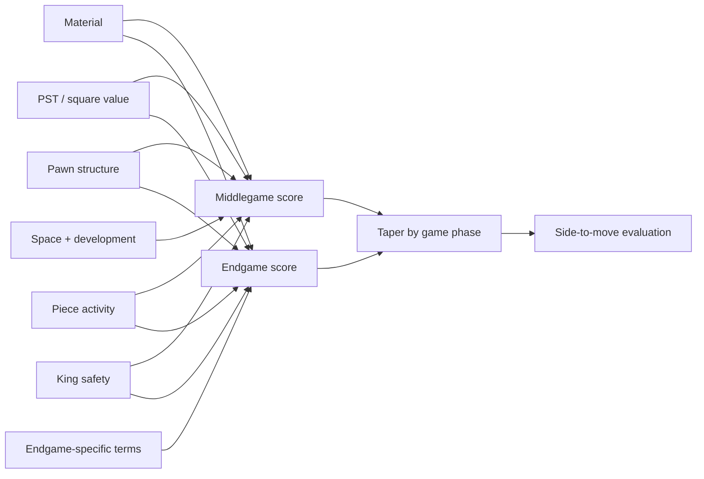

# Aquila Architecture



## Position state

The board keeps both a mailbox array and color/piece bitboards. This deliberately trades a little update work for cheap piece lookup while leaving the core representation bitboard-native.

Zobrist hashing incorporates piece-square occupancy, side to move, castling rights and en-passant square. During move execution, the key is updated incrementally by XORing only changed piece/state components; unmake restores the saved key in O(1). The repetition stack stores keys for the played line.

## Search

The search is a negamax alpha-beta tree with iterative deepening. Non-first moves use a PVS-style null window. Move ordering uses TT moves, SEE-ranked captures, promotions, killers, counter-moves, and history-ranked quiet moves. The search adds aspiration windows, history/PV/check-aware LMR, guarded and verified null-move pruning, and selective shallow futility pruning. Check and recapture moves receive a one-ply extension. The TT uses four entries per bucket with generation metadata and depth/age-aware replacement so collisions do not automatically destroy unrelated entries.

Quiescence is selective rather than capture-only. Outside check, stand-pat establishes the static floor; captures are filtered by SEE, promotions are retained, and quiet checks are admitted only at bounded q-depth. Delta pruning rejects captures/promotions whose optimistic material swing plus margin cannot reach alpha. In-check nodes skip stand-pat and search all legal evasions so check legality is never hidden by a selective filter.

The current implementation is intentionally single-threaded. SMP is a separate engineering phase because synchronization, split scheduling and shared-history quality can easily make a nominally parallel search slower.

## Evaluation

The evaluator is a tapered HCE. Material and piece-square values have separate middlegame/endgame components, then all classical terms are interpolated by a 24-point non-pawn game-phase scale. The evaluator is layered rather than a single material-plus-PST score:



Pawn terms include passed/protected passers, isolated/doubled/backward/connected pawns, chains and pawn islands. Piece terms include mobility, outposts, bishop pair, rook open/semi-open files, 7th-rank activity, trapped-piece penalties and coordination. King terms include shelter, pawn shield, enemy attacks on the king ring, open files and safe king squares. Space/development terms cover central control, occupied/controlled space and undeveloped minor pieces. Endgame terms emphasize king activity, passed-pawn races and rooks behind passed pawns.

NNUE is not stubbed as if it were trained. The intended production path is a separate feature/accumulator layer so network representation and inference can evolve without rewriting move generation or search.


## Search-state invariants

The engine keeps an independent canonical Zobrist recomputation path for regression validation even though normal search uses incremental hashing. Core tests deliberately exercise captures, promotions, en-passant and castling.

TT regression tests cover clustered collisions, depth replacement, generation aging, stored bounds, depth eligibility, mate-score normalization, and the rule that a cached root result does not suppress a fresh root search.


## Move ordering

The primary ordering hierarchy is intentionally explicit:

```
TT move
  → non-losing SEE captures
  → promotions
  → killer moves
  → counter-move
  → history-ranked quiet moves
  → losing captures / remaining moves
```

SEE is a static exchange calculation that models alternating least-valued attackers on the target square, including sliding-piece x-rays and special-move capture accounting. It is used for ordering only; legal move generation remains authoritative.

## Search heuristics

Iterative deepening uses aspiration windows around the previous iteration's score and widens on fail-low/high. LMR reductions depend on move number, depth, history quality and node type, and are suppressed for checks and priority tactical moves. Null-move pruning is disabled in low-material positions and uses verification at deeper cutoffs. Futility pruning is restricted to shallow non-PV quiet moves and excludes tactical/priority moves.

Singular extensions and passed-pawn-specific extensions are intentionally deferred until this baseline can be measured independently.
